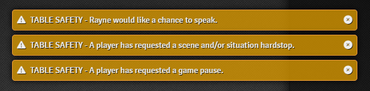
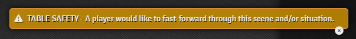

# Table Safety

Built to work alongside other safety tools, and utilizing the [TTRPG Safety Toolkit](https://ttrpgsafetytoolkit.com) as its primary inspiration.
This module is designed to slim down the official tools, and provides 4 tools, with quick access, for players to alert the GM of potential issues. This includes the following buttons,
above the chat options menu in the chat-log tab.

## For Players

### Pause

Pressing this button as a player, will alert the GM that someone would like the game and narration to be paused. This is a great option to let the GM 
know that you need a break, or that you want to speak with the GM in private at the earliest possible convenience. On the GMs side, they will receive 
a notification that must be dismissed manually, and an acknowledge button will light up, which can be pressed to tell that player that the GM got the
request, and acknowledged it.

**For only the pause safety**, the game will pause when the GM acknowledges requests.

**The player who pressed this button is not revealed, not even to the GM**

### Hardstop

This button is designed to work practically identically to the "X Card" from the [TTRPG Safety Toolkit](https://ttrpgsafetytoolkit.com). When pressed,
it will alert the GM that someone has requested a "scene / situation hardstop", which MUST be dismissed manually by the GM. Again, the GM can press
their acknowledge button, which will alert the player that pressed the button that the GM saw their request. 

**The player who pressed this button is not revealed, not even to the GM**

### Fast-Forward

A very simple premise. For any reason, press this button to alert the GM that you'd like this particular scenario to be sped up. This can easily be used for
a "fade-to-black" moment. Much like the other buttons, this will alert the GM that a player would like to fast forward, but does not tell the GM what player it was.

**The player who pressed this button is not revealed, not even to the GM**

### Hands

This button is a simple "raise hand" alert. When pressed, it will let all other players know *"Another player is would like the chance to speak."*, without 
revealing the player that pressed it, and will tell the GM *"Player `X` would like the chance to speak."*. This will allow the GM to see who is trying to 
speak, and can help spin a conversation towards letting that particular player speak.

## For GMs

Want to give your players a lot more freedom with deciding on which content they're comfortable with, and you'd like to make the explanation as simple
as possible while still giving plenty of room for expression? This module has a simple suite of 4 buttons, each with their own purpose, to help your players
communicate safely with you, about what they do, and do not like. Additionally, the inclusion of a very simple "raise hand" button, makes it incredibly
easy for you to navigate a conversation in a way to help that player get to speak, especially in parties with one or two very talkative players. 

On top of all of that, you'll never see what player pressed what button, except for if they use "raise hand". Only that button expresses the player's username
to GM, and ONLY GM so that you can give that player emphasis. All other players will only see "Another player would like the chance to speak", which may sometimes
be the only encouragement to pause an ongoing conversation needed.

<video controls src="gm-acknowledge-button.mp4" title="GM Acknowledge Button" loop muted autoplay></video>

## Settings

This module does not presently have any settings that are customizeable. 

## Contributions 

I happily welcome bug, feature requests, and questions and concerns via GitHub Issues, but will not accept pull requests from external repositories. 